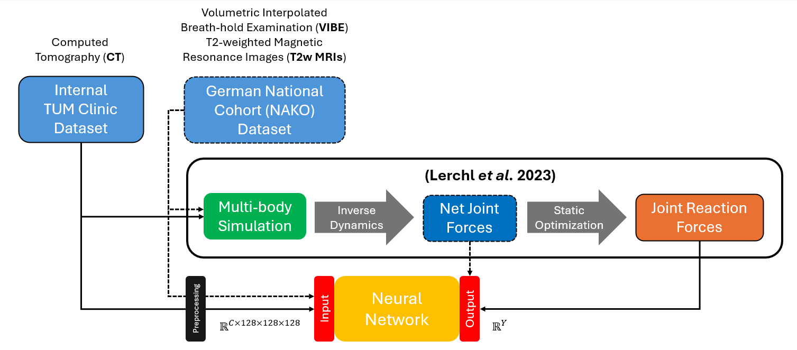
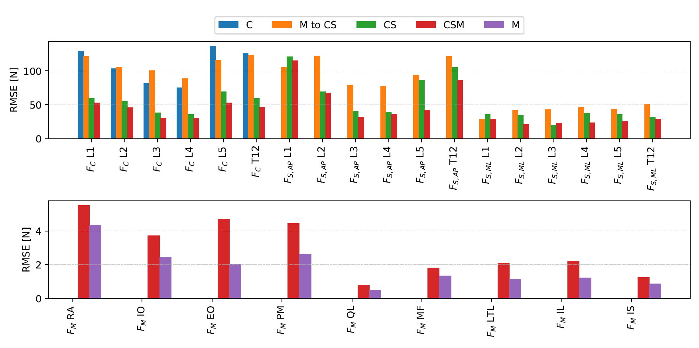

# Neural Surrogate Models for Biomechanical Forces in the Spine
The repository shorty summarizes the interdisciplinary project I have worked on to attain the Master's Degree in Chemical
Biotechnology at the Technical University of Munich (TUM). It was joint collaboration between TUM Campus Straubing and
the TUM School of Computation, Information, and Technology. 

Many thanks to my examiners [Prof. Dominik Grimm](https://github.com/dominikgrimm) and Prof. Benedikt Wiestler for allowing
me to work on this fascinating project, as well as my supervisors [Jonas Weidner](https://github.com/jonasw247) and Dr.
Tanja Lerchl for dedicating their, their invaluable advice and constant support, which made the 6-month-long joint
collaboration a pleasure.

 

## Objectives
To address the lack of benchmarks for predicting biomechanical forces (specifically lumbar loads), the usage of small
datasets for training resulting in models unable to generalize to a wider population, and the inconsistent task definition
to be performed when collecting the training data across the literature.

For this purpose a convolutional ([ResNet3D](https://arxiv.org/abs/1711.11248)) and an attention-based
([Video Swin Transformer](https://arxiv.org/abs/2106.13230)) neural network capable of approximating lumbar spinal loads
from volumetric images were trained. These map directly from volumetric T2-weigthed Magnetic Resonance Images (MRIs), 
Computed Tomography (CT), or Volumetric Interpolated Breath-hold Examination (VIBE) scans to net joint forces, or 
reaction joint forces acting at the lumbar spine. 
In contrast to previous research, the model inputs were sampled from two large datasets collected from diverse demographics.
The same volumetric scans were used in combination with an automated pipeline to generate Multibody Simulation models.
By using Inverse Dynamics and subsequently Static Optimization, respectively the net joint forces and the reaction joint
forces were approximated and defined as the regression target for the above-mentioned neural networks.
To author's best knowledge, it is the first known attempt to train such models.

The network performance was investigated by training on inputs containing different amounts of anatomical structures, 
predicting target variables in various combinations, and conditioning on non-image features. 
Furthermore, statistical analysis of target variable distributions and the correlation between them was investigated to
assess their influence on neural network performance.

## Results & Discussion

- Compared with volumetric scans depicting sole trunks, the **inputs with more anatomical features** including the
patient's fatty tissues or vital organs, **improve overall model accuracy**. However, the improvement is mainly
seen in inferior-superior forces (equivalent to compression forces) and medial-lateral moments in net joint forces.
- Including **multiple reaction joint forces in the training target** acts as a regularizer during training, which 
improves model's predictive accuracy. Yet, while the **accuracy on compression and shear forces improves**, it 
simultaneously **diminishes for muscle forces**.
- **Including the net joint forces acting at L6 decreases model performance**. This is mainly due to the low frequency of
such samples in, and the substitution of missing values in regular patients (without the L6) with zero, which has shifted 
the target distribution.
- The Video Swin Transformer achieves comparable performance to the ResNet3D with equal amount of training data and training
time. 

## Limitations & Outlook
- When evaluating the network performance different types of patients and the diseases affecting them was not considered. 
Future research should evaluate whether the predictive accuracy changes for patients with varying severity of spinal
diseases.
- The lacking hyperparameter and architecture tuning of the MLP most likely resulted in diminished performance of the
conditioned ResNet3Ds. It is plausible that hyperparameter optimization combined with might yield better results. 
- The substitution of missing values of net joint forces acting at L6 with zero for healthy patients without the anomalous
L6 lumbar vertebra has centered the distribution of target variables around 0. Combined with usage of MSE loss function
and the lacking normalization of target variables, the neural network is optimized to minimize the error on forces with
the highest magnitudes. Moreover, in the case of net joint forces at L6, it predicts the average value of the dataset 
(zero) instead of values of interest.  
